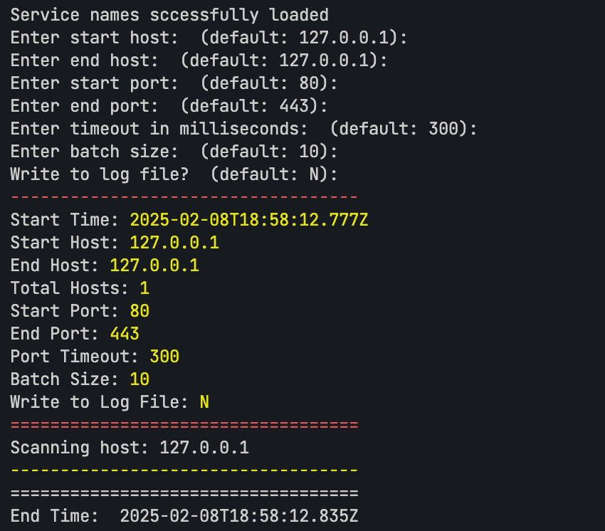

# Port Scanner
A network utility tool for scanning TCP ports and identifying running services.

## Description

This Port Scanner is a tool designed to scan network ports and identify services running on target systems. It utilizes a comprehensive database of well-known ports and services based on IANA's Service Name and Port Number Registry.

## Features

- TCP port scanning
- Service identification based on port numbers
- Detailed service information including:
  - Service names
  - Protocol used
  - Service description

## Port Data Source

The service information is sourced from IANA's Service Name and Port Number Registry, stored in `service-names-port-numbers.csv`, which includes:
- Port numbers
- Service names
- Protocol information
- Service descriptions
- Assignee information

### Setup and usage
1. Clone the repository:  
   ```bash
   git clone https://github.com/Farsheed/PortScanner
   cd portscanner
   ```
2. Install dependencies:  
   ```bash
   npm install
   ```
3. Start the application:  
   ```bash
    npm start
   ```
4. You will be asked about the starting IP address, ending IP address, and the port range to scan.


